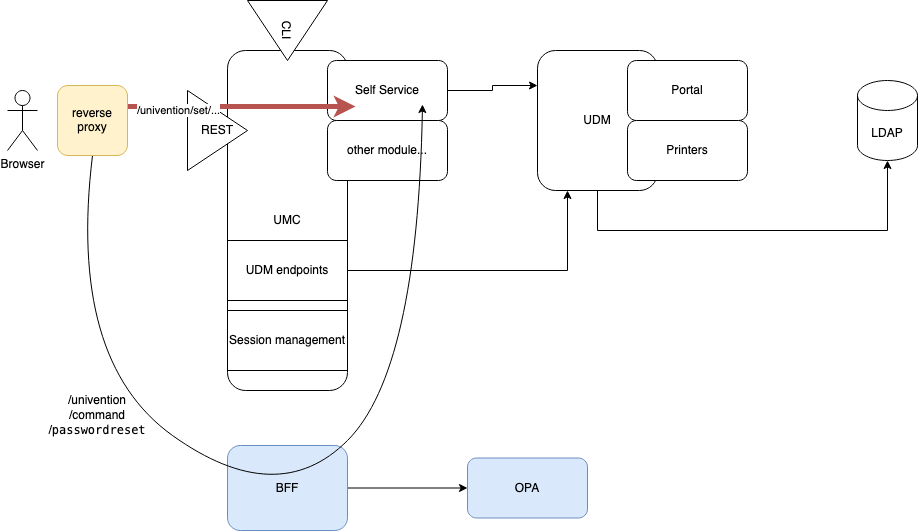

# self-service API with OPA

This repository contains a Proof-of-Concept for the integration of the portal
self-service API with [OPA](https://www.openpolicyagent.org/).

## Local development

This repository uses and is strongly based on all the containers resulting
from [`univention-portal`](https://git.knut.univention.de/univention/components/univention-portal).

To get started, follow this steps:
1. Install the Univention Self-Service on your UCS host:
   ```sh
   apt install univention-self-service-master
   ```
2. Configure your `.env` file based upon `.env.example`.
    1. If you are using Mac, please change the local IPs to `host.docker.internal`.
3. Please refer to the documentation of the univention-portal for details
   on how to prepare your UCS for use with Keycloak.
   a. Apply the Ansible scripts from the portal.
   b. Copy the certificate to `./keycloak/ucs-root-ca.crt`.
   c. Fill your LDAP settings
      in your `docker-compose.override.yaml`
      based on ``docker-compose.override.yaml.example`.
4. Use `docker compose up -d --build` to bring the setup up.

## pre-commit

This repository makes use of [`pre-commit`](https://pre-commit.com/),
which is also checked on the pipeline.

You can run it locally like this:
```sh
docker compose run pre-commit
```

# Architecture

As a first approach, the following architecture has been sketched:



The idea behind it is to implement OPA in a self-contained way, that does not
affect the front-end (given a configured reverse proxy). As a result, there
should exist a drop-in replacement for the self-service API.
